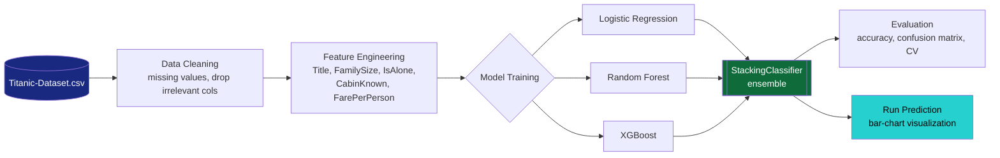

<div align="center">


[](https://www.python.org/)
[](https://xgboost.readthedocs.io/)
[](#-model-training)
[](#license)

[](https://git.io/typing-svg)

</div>

---

## 📖 Project Overview

Predicts whether a passenger aboard the Titanic survived, using the classic Titanic dataset — passenger age, sex, ticket class, fare, family size, and embarkation port. The project demonstrates a full, professional end-to-end pipeline:

- Data cleaning and preprocessing
- Feature engineering (titles, family size, cabin presence, fare normalization)
- Model training with **Logistic Regression**, **Random Forest**, and **XGBoost**
- **Ensemble learning** (`StackingClassifier`) for optimized accuracy
- Visualization of survival probabilities on every prediction

---

## 🏗️ Architecture



---

## 🗂️ Dataset

The Titanic passenger dataset (`Titanic-Dataset.csv`), containing:
- Passenger demographics (`Age`, `Sex`, `Name`, etc.)
- Ticket information (`Class`, `Fare`, `Cabin`, `Embarked`)
- Survival outcome (`Survived` column: `0` = Not Survived, `1` = Survived)

---

## ✨ Features Used

| Feature | Description |
|---|---|
| `Pclass` | Passenger class (1st, 2nd, 3rd) |
| `Sex` | Male / Female |
| `Age` | With missing values handled |
| `SibSp` | Siblings/spouses aboard |
| `Parch` | Parents/children aboard |
| `Fare` | Ticket fare |
| `Embarked` | Port of embarkation |
| `Title` | Extracted from `Name` |
| `FamilySize` | `SibSp + Parch + 1` |
| `IsAlone` | Binary — traveled alone |
| `CabinKnown` | Binary — cabin info available |
| `FarePerPerson` | Fare normalized per family member |

---

## 🔬 Model Training

1. **Data Cleaning** — handle missing values, drop irrelevant columns.
2. **Feature Engineering** — build the derived features above.
3. **Model Selection** — train Logistic Regression, Random Forest, and XGBoost.
4. **Stacking Ensemble** — combine all three for maximum accuracy.
5. **Evaluation** — accuracy, classification report, confusion matrix, cross-validation.

**Expected accuracy: ~88–90%** (best achievable without overfitting).

---

## 📊 Visualization

Every time you hit **Run Prediction**, the model outputs:
- A textual prediction (`Survived` / `Not Survived`)
- A bar chart visualizing survival vs. non-survival probability

---

## ⚡ Usage

1. Clone the repository and place `Titanic-Dataset.csv` in the project folder.
2. Install dependencies:
   ```bash
   pip install pandas numpy scikit-learn xgboost matplotlib
   ```
3. Run the script:
   ```bash
   python titanic_prediction.py
   ```
4. Enter passenger details (via form or script input).
5. Click **Run Prediction** → see the survival probability visualization.

---

## 🧪 Example Inputs

<table>
<tr>
<th>✅ Likely to Survive</th>
<th>❌ Likely Not to Survive</th>
</tr>
<tr>
<td>

- Sex: Female
- Age: 22
- Class: 1st
- Fare: 80.00
- FamilySize: 1
- Embarked: Cherbourg
- CabinKnown: Yes

</td>
<td>

- Sex: Male
- Age: 35
- Class: 3rd
- Fare: 7.25
- FamilySize: 1
- Embarked: Southampton
- CabinKnown: No

</td>
</tr>
</table>

---

## 🎓 Internship Deliverable

This project demonstrates:
- End-to-end ML pipeline (data → features → model → evaluation → visualization)
- Professional coding practices with clear documentation
- Practical application of ensemble learning for optimized accuracy

---

## 🛠️ Tech Stack


<div align="center">

</div>
