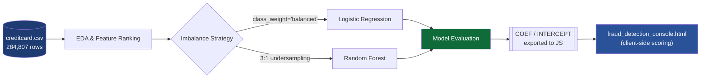

<div align="center">


[](https://www.python.org/)
[](https://scikit-learn.org/)
[](#results)
[](#license)

[](https://git.io/typing-svg)

</div>

---

## 📖 Overview

A fraud-detection pipeline trained on **284,807 real anonymized transactions**, only **492 (0.17%) of which are fraudulent** — a severe class-imbalance problem tackled head-on rather than papered over with accuracy. The project ships two things: a reproducible **training pipeline** and a **zero-install, single-file browser dashboard** that scores transactions live using the real trained model.

---

## 🏗️ Architecture

<div align="center">

</div>

<details>
<summary>Mermaid source (fallback / editable)</summary>



</details>

> The Logistic Regression model is the one deployed to the dashboard — its coefficients are simple enough to embed directly in JavaScript, coming within a hair of the Random Forest's accuracy without needing a server.

---

## 📁 Project Structure

```text
.
├── fraud_detection_model.py       # EDA, feature selection, model training, evaluation, predict_fraud()
├── fraud_detection_console.html   # standalone interactive dashboard (open directly, no server)
└── creditcard_sample.csv          # ~600-row excerpt for column reference
```

> The full dataset (150 MB, 284,807 rows) isn't bundled. To retrain, drop your own `creditcard.csv` (columns: `Time, V1..V28, Amount, Class`) into this folder.

---

## 🔬 Methodology

### Feature selection
Every one of the 30 features was ranked by how far its fraud-class mean sits from its genuine-class mean (in standard deviations), cross-checked against Random Forest importance scores. **10 features carried real signal:**

`V14 · V4 · V10 · V12 · V17 · V11 · V3 · V16 · V7 · Amount`

`Time` and 18 of the 28 anonymized PCA components were dropped for barely separating fraud from genuine transactions.

### Handling severe imbalance
At 0.17% fraud, a naive classifier hits 99.8% accuracy by predicting "genuine" every time — worthless. Two strategies were compared head-to-head:

| Strategy | Outcome |
|---|---|
| `class_weight='balanced'` on full data | ✅ **Winner** — best precision/recall trade-off |
| Manual 3:1 undersampling | Discarded too much genuine data; precision dropped sharply |

---

## 📊 Results

Evaluated on **56,962 held-out transactions** the model never saw during training:

| Model | Precision | Recall | F1 | ROC-AUC |
|---|:---:|:---:|:---:|:---:|
| Logistic Regression (tuned threshold) | 0.82 | 0.82 | 0.82 | 0.971 |
| **Random Forest** | **0.84** | 0.82 | **0.83** | **0.977** |

Random Forest edges ahead, but a 300-tree forest can't live inside a static HTML page — so the dashboard runs **Logistic Regression** client-side instead.

---

## ⚡ Quick Start

### Train / retrain the model
```bash
pip install pandas numpy scikit-learn
python fraud_detection_model.py
```
This reprints the EDA, feature ranking, imbalance comparison, and final metrics. Copy the refreshed `COEF` / `INTERCEPT` / `Z_THRESHOLD` values into `fraud_detection_console.html`'s `<script>` block to update the dashboard.

### Run the dashboard
Just double-click `fraud_detection_console.html` — everything (sample data, model coefficients, charting) is bundled in one file. Load a sample transaction or set your own values across the 10 sliders, then hit **Scan transaction**.

---

## 🖥️ Reading the Dashboard

| Element | What it shows |
|---|---|
| **Verdict badge** | Fraud / Genuine, from the model's decision boundary |
| **Fraud risk score (0–100)** | Normalized model score; the gauge's line marks the decision boundary |
| **Top signals** | Which of the 10 features pushed the verdict toward fraud (red) or genuine (green) |
| **Scatter plot** | This transaction plotted against 400 real transactions on `V14` vs `V4` — fraud clusters tightly lower-right |

---

## 🛠️ Tech Stack


<div align="center">

</div>
