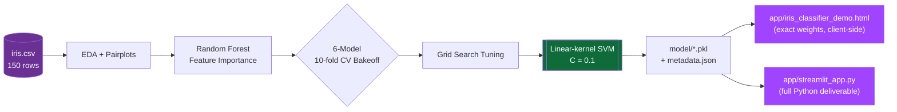

<div align="center">


[](https://www.python.org/)
[](https://streamlit.io/)
[](#-results)
[](#license)

[](https://git.io/typing-svg)

</div>

---

## 🎯 Objective

Classify Iris flowers into **setosa**, **versicolor**, or **virginica** from four sepal/petal measurements — using the features that matter most, with the highest achievable accuracy, and shipped as two working, fully functional UIs.

---

## 🏗️ Architecture

<div align="center">

</div>

<details>
<summary>Mermaid source (fallback / editable)</summary>



</details>

---

## 📁 Project Structure

```text
.
├── data/
│   └── iris.csv                    # source dataset (150 rows, 4 features + species)
├── train_model.py                  # full training pipeline (EDA → tuning → export)
├── model/
│   ├── iris_model.pkl              # final trained model (SVM, linear kernel)
│   ├── scaler.pkl                  # StandardScaler fit on all 150 samples
│   ├── label_encoder.pkl           # species label encoder
│   ├── metadata.json               # accuracy, params, feature importance, stats
│   └── dataset.json                # dataset exported for the browser demo
├── reports/                        # EDA + evaluation plots (generated by train_model.py)
├── app/
│   ├── iris_classifier_demo.html   # standalone interactive demo — open directly, no server
│   └── streamlit_app.py            # full Streamlit app
└── requirements.txt
```

---

## 🔬 Methodology

### 1. Exploratory data analysis
Verified perfect class balance (50/50/50) and zero missing values. Pairplots and boxplots showed **petal measurements separate species far more cleanly than sepal measurements**, with *setosa* clearly isolated on nearly every feature.

### 2. Feature importance
A Random Forest was used purely as a fast importance estimator, not the final model:

| Feature | Importance |
|---|:---:|
| Petal length | 45.0% |
| Petal width | 41.0% |
| Sepal length | 12.2% |
| Sepal width | 1.9% |

**Petal measurements carry ~86% of the classification signal** — matching known biology, since petal shape varies far more distinctly between Iris species than sepal shape does.

### 3. Model comparison
Six algorithms compared with **10-fold stratified cross-validation** on standardized features:

| Model | CV Accuracy |
|---|:---:|
| **SVM (linear kernel)** | **96.67%** |
| Logistic Regression | 95.83% |
| K-Nearest Neighbors | 95.83% |
| Decision Tree | 95.00% |
| Random Forest | 95.00% |

### 4. Hyperparameter tuning
Grid search over the top candidates confirmed **linear-kernel SVM (`C=0.1`)** as the strongest, most stable performer.

---

## 📊 Results

Because 150 rows makes any single split noisy (a 20% holdout is only 30 samples), accuracy is reported three ways:

| Metric | Value |
|---|:---:|
| 10-fold CV accuracy (full dataset) | **95.3%** |
| Held-out test set accuracy (30 samples) | 93.3% |
| Cross-validated training accuracy | 96.7% |

*Setosa* is linearly separable and classified correctly **100% of the time**. Nearly all remaining error sits between *versicolor* and *virginica*, whose petal measurements genuinely overlap at the boundary — a property of the data itself, not a model weakness.

---

## 🖥️ Two Working UIs

### A. Interactive browser demo — `app/iris_classifier_demo.html`
Open directly in any browser — no server, no install.
- Sliders drive a **botanical line-illustration** that redraws live, scaled to your measurements.
- The SVM's **exact learned weights are embedded in the page** — every prediction is the real model running client-side (verified to match the Python model on all 150 samples).
- Shows the pairwise vote breakdown and the 3 nearest specimens from the real training data.

### B. Streamlit app — `app/streamlit_app.py`
The full Python deliverable: loads the real saved `.pkl` model, prediction probabilities, a radar chart against species averages, the model comparison table, feature importance chart, and all EDA plots.

```bash
pip install -r requirements.txt
streamlit run app/streamlit_app.py
```

---

## ⚡ Quick Start

```bash
pip install -r requirements.txt
python train_model.py
```
Regenerates everything in `model/` and `reports/` from scratch — EDA plots, model comparison chart, hyperparameter search, final model, and confusion matrices.

---

## 🛠️ Tech Stack


**ML**: scikit-learn (SVM, KNN, Random Forest, Logistic Regression, Decision Tree), GridSearchCV, StratifiedKFold · **Data**: pandas, numpy · **Viz**: matplotlib, seaborn, plotly · **UI**: Streamlit + vanilla HTML/CSS/JS

<div align="center">

</div>
