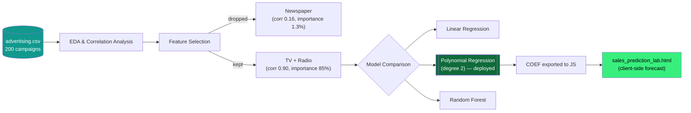

<div align="center">


[](https://www.python.org/)
[](https://scikit-learn.org/)
[](#-results)
[](#license)

[](https://git.io/typing-svg)

</div>

---

## 📖 Overview

Predicts advertising **Sales** from **TV**, **Radio**, and **Newspaper** spend across 200 historical campaigns — and ships a single-file interactive dashboard that runs the real trained model directly in the browser.

---

## 🏗️ Architecture



---

## 📁 Project Structure

```text
.
├── advertising.csv               # source dataset: TV, Radio, Newspaper spend + Sales
├── sales_prediction_model.py     # EDA, feature selection, model comparison, predict_sales()
└── sales_prediction_lab.html     # standalone interactive dashboard (open directly, no server)
```

---

## 🔬 Methodology

**Polynomial regression (degree 2)** on **TV** and **Radio** spend only. `Newspaper` was dropped after feature selection showed it contributes almost nothing — **0.16 correlation**, **1.3% Random Forest importance** — against TV's **0.90 correlation** and **85% importance**. The polynomial terms capture the real-world synergy between TV and radio campaigns running together.

---

## 📊 Results

Performance on held-out test data:

| Metric | Value |
|---|:---:|
| R² | **0.954** |
| RMSE | 1.19 (thousand units) |
| MAE | 0.88 (thousand units) |
| Training samples | 200 (80/20 split) |

---

## ⚡ Quick Start

### Train / retrain the model
```bash
pip install pandas numpy scikit-learn
python sales_prediction_model.py
```
Reprints the EDA, feature importances, model comparison table, and final coefficients — copy the refreshed `COEF` values into `sales_prediction_lab.html`'s `<script>` block to update the dashboard.

### Run the dashboard
Just double-click `sales_prediction_lab.html`, or open it in a browser. Everything (data, coefficients, charting) is bundled in the single file — nothing else to install. Move the **TV** and **Radio** faders, click **Run forecast**, and it predicts Sales and plots the result against all 200 historical campaigns.

---

## 🛠️ Tech Stack


<div align="center">

</div>
