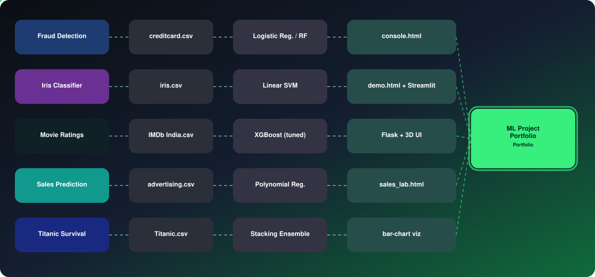
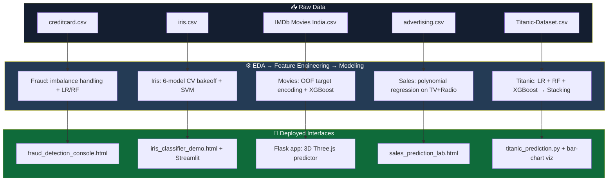
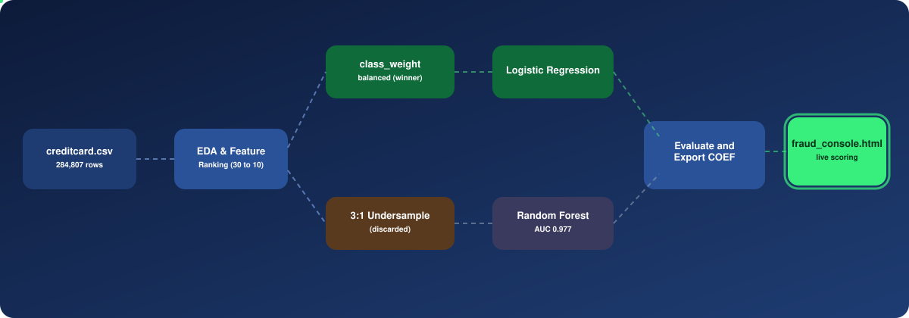
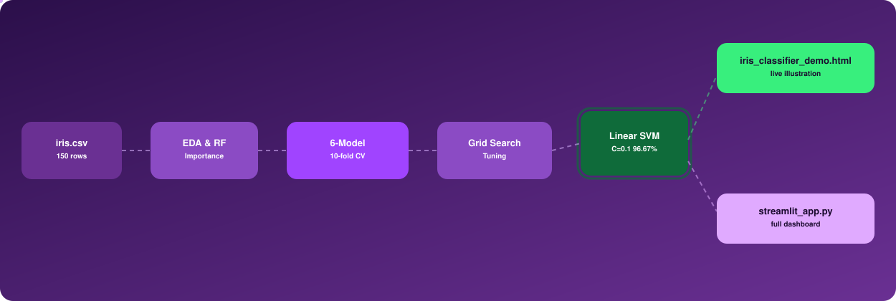
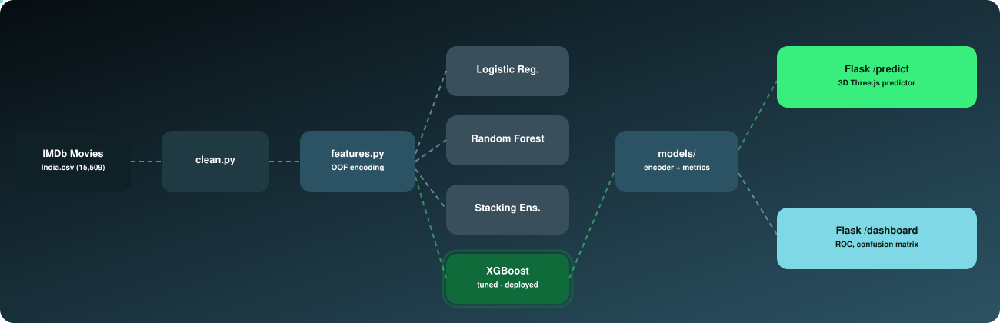
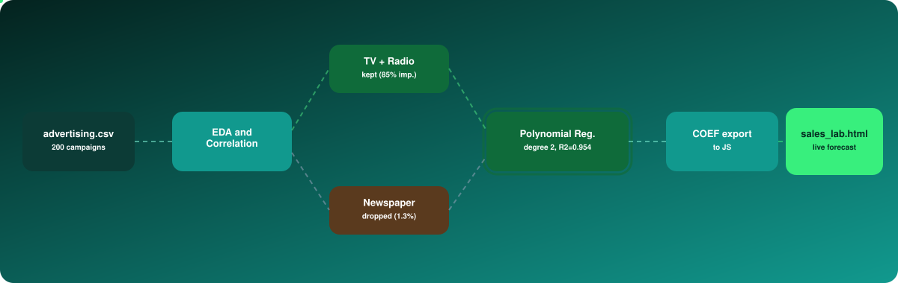
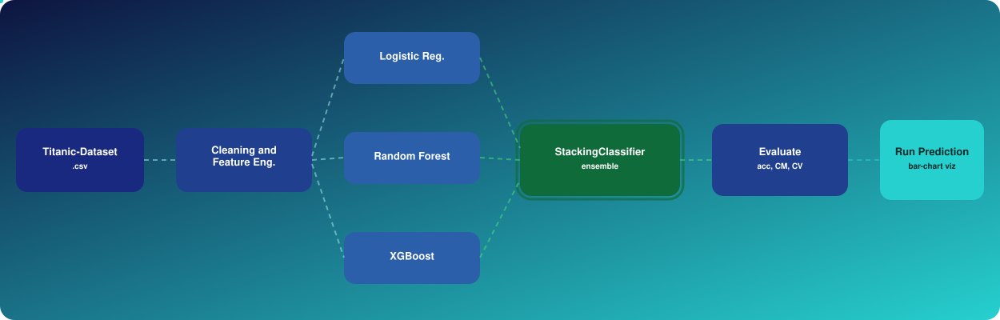

<div align="center">


[](https://www.python.org/)
[](https://scikit-learn.org/)
[](https://xgboost.readthedocs.io/)
[](https://flask.palletsprojects.com/)
[](https://streamlit.io/)
[](#license)

[](https://git.io/typing-svg)

</div>

---

## 📚 Table of Contents

| # | Project | Task | Best Model | Headline Metric |
|---|---|---|---|---|
| 1 | [Credit Card Fraud Detection](#1--credit-card-fraud-detection) | Binary classification | Logistic Regression (deployed) | ROC-AUC **0.971** |
| 2 | [Iris Species Classification](#2--iris-species-classification) | Multi-class classification | SVM (linear kernel) | CV Accuracy **96.67%** |
| 3 | [Movie Rating Prediction (IMDb India)](#3--movie-rating-prediction-imdb-india) | Binary classification | XGBoost (tuned) | ROC-AUC **0.847** |
| 4 | [Sales Prediction](#4--sales-prediction) | Regression | Polynomial Regression | R² **0.954** |
| 5 | [Titanic Survival Prediction](#5--titanic-survival-prediction) | Binary classification | Stacking Ensemble | Accuracy **~88–90%** |

---

## 🗺️ Portfolio Architecture

<div align="center">

</div>

<details>
<summary>Mermaid source (fallback / editable)</summary>



</details>

---

## 📁 Repository Layout

```text
.
├── 01-fraud-detection/
│   ├── fraud_detection_model.py
│   ├── fraud_detection_console.html
│   └── creditcard_sample.csv
├── 02-iris-classification/
│   ├── data/iris.csv
│   ├── train_model.py
│   ├── model/               # iris_model.pkl, scaler.pkl, label_encoder.pkl, metadata.json
│   ├── reports/
│   └── app/                 # iris_classifier_demo.html, streamlit_app.py
├── 03-movie-rating-prediction/
│   ├── src/                 # clean.py, features.py, train.py
│   ├── app/                 # app.py, templates/, static/
│   ├── models/
│   └── run_app.py
├── 04-sales-prediction/
│   ├── advertising.csv
│   ├── sales_prediction_model.py
│   └── sales_prediction_lab.html
└── 05-titanic-survival/
    ├── Titanic-Dataset.csv
    └── titanic_prediction.py
```

---

## 1 · Credit Card Fraud Detection

Classifies transactions as fraudulent or genuine, trained on **284,807 real transactions** (492 fraud, **0.17%**).

<div align="center">
  
</div>

**Feature selection** ranked all 30 features by class separation; 10 carried real signal: `V14, V4, V10, V12, V17, V11, V3, V16, V7, Amount`. **Imbalance handling** compared `class_weight='balanced'` against 3:1 undersampling — class-weighting won.

| Model | Precision | Recall | F1 | ROC-AUC |
|---|:---:|:---:|:---:|:---:|
| Logistic Regression (deployed) | 0.82 | 0.82 | 0.82 | 0.971 |
| Random Forest | 0.84 | 0.82 | 0.83 | 0.977 |

**Ships with:** `fraud_detection_console.html` — a zero-install dashboard with a live risk gauge, top contributing signals, and a scatter plot against 400 real transactions.

```bash
pip install pandas numpy scikit-learn
python fraud_detection_model.py
```

---

## 2 · Iris Species Classification

Classifies *setosa* / *versicolor* / *virginica* from sepal/petal measurements. Petal measurements carry **~86% of the classification signal**. Six algorithms were compared with 10-fold stratified CV:

<div align="center">
  
</div>

| Model | CV Accuracy |
|---|:---:|
| **SVM (linear kernel)** | **96.67%** |
| Logistic Regression | 95.83% |
| Random Forest | 95.00% |

*Setosa* is classified correctly **100%** of the time; remaining error sits at the genuine versicolor/virginica overlap.

**Ships with:** a browser demo whose sliders redraw a live botanical illustration using the model's exact embedded weights, plus a full Streamlit app with radar charts and EDA plots.

```bash
pip install -r requirements.txt
python train_model.py            # retrain
streamlit run app/streamlit_app.py   # or run the full app
```

---

## 3 · Movie Rating Prediction (IMDb India)

Predicts whether a film will be **High-Rated** (IMDb ≥ 6.5) from five pre-release inputs — Genre, Director, Lead Actor, Year, expected Votes — on **15,509 films**.

<div align="center">
  
</div>

| Model | Accuracy | ROC-AUC |
|---|:---:|:---:|
| **XGBoost (tuned) — deployed** | **0.783** | **0.847** |
| Stacking Ensemble | 0.782 | 0.847 |
| Baseline (majority class) | 0.634 | 0.500 |

A **+14.9 point lift** over baseline. Out-of-fold target encoding keeps `Director`/`Actor` leakage-free.

**Ships with:** a Flask app featuring a full **3D Three.js** scene — a starfield, a glowing probability meter, and a mouse-reactive tilting form card — plus a results dashboard with ROC curves and confusion matrices.

```bash
pip install -r requirements.txt
python -m src.train "path\to\IMDb Movies India.csv"
python run_app.py   # → http://127.0.0.1:5000
```

---

## 4 · Sales Prediction

Predicts advertising **Sales** from **TV**, **Radio**, and **Newspaper** spend across 200 campaigns. `Newspaper` was dropped (0.16 correlation, 1.3% importance) in favor of **TV + Radio** polynomial regression (degree 2), capturing real campaign synergy.

<div align="center">
  
</div>

| Metric | Value |
|---|:---:|
| R² | **0.954** |
| RMSE | 1.19k units |
| MAE | 0.88k units |

**Ships with:** `sales_prediction_lab.html` — move the TV/Radio faders, click **Run forecast**, see the prediction plotted against all 200 historical campaigns.

```bash
pip install pandas numpy scikit-learn
python sales_prediction_model.py
```

---

## 5 · Titanic Survival Prediction

Predicts passenger survival from demographics, ticket class, fare, and family features (`Title`, `FamilySize`, `IsAlone`, `CabinKnown`, `FarePerPerson`). Logistic Regression, Random Forest, and XGBoost are combined via a **`StackingClassifier`** for **~88–90% accuracy**.

<div align="center">
  
</div>

**Ships with:** a bar-chart visualization of survival probability on every prediction run.

```bash
pip install pandas numpy scikit-learn xgboost matplotlib
python titanic_prediction.py
```

---

## 🛠️ Combined Tech Stack


Every project follows the same discipline: rigorous **EDA → feature selection → multi-model comparison → held-out evaluation**, and every model is shipped behind a **working, zero-friction interface** — a static HTML dashboard, a Streamlit app, or a full Flask + 3D UI — so results are something you can click through, not just read in a table.

## 📄 License

MIT — see individual project folders for details.

<div align="center">


**⭐ If this portfolio was useful, consider starring the repo!**

</div>
